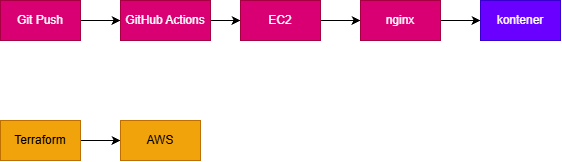

# Zabezpieczony serwer Linux na AWS EC2 (nginx + Docker + HTTPS + Terraform + CI/CD)

Projekt edukacyjny, w którym od zera postawiłem i zabezpieczyłem serwer w chmurze, uruchomiłem na nim stronę w kontenerze Dockera za reverse proxy z HTTPS, a następnie opisałem infrastrukturę w Terraformie i zautomatyzowałem wdrażanie zmian przez GitHub Actions.

**Adres działającej strony:** https://oskarprojekt.duckdns.org *(Serwer jest aktualnie wyłączony, wyłączam go dla oszczędności kosztów)*

## Użyte technologie

AWS EC2 (Ubuntu Server LTS), Elastic IP, Security Groups, Linux (SSH, ufw, fail2ban, cron, bash), nginx, Docker, Let's Encrypt (certbot), DuckDNS, Terraform, Git, GitHub Actions.

## Architektura

```
                    git push
Developer ───────────────────────► GitHub ──► GitHub Actions
                                                    │ scp przez SSH (klucz w GitHub Secrets)
                                                    ▼
Użytkownik ──HTTPS──► DuckDNS ──► Elastic IP ──► EC2 (Ubuntu)
                                                    │
                                              nginx (reverse proxy, :80/:443, certyfikat Let's Encrypt)
                                                    │
                                              kontener Docker (nginx, :8080) ◄── katalog ze stroną

Terraform ──► AWS (security group, instancja EC2, Elastic IP)
```

**

## Co zrobiłem, krok po kroku, i dlaczego

1. **Instancja EC2 (Ubuntu Server LTS) i key pair.** Logowanie wyłącznie kluczem SSH, bez haseł.
2. **Security Group:** SSH ograniczony do mojego adresu IP, HTTP (80) i HTTPS (443) otwarte publicznie. Zasada minimalnych uprawnień: otwarte tylko te porty, które są potrzebne.
3. **Połączenie przez SSH i aktualizacja systemu** (`apt update && apt upgrade`).
4. **Własny użytkownik z sudo i kluczem SSH** zamiast pracy na domyślnym koncie `ubuntu`.
5. **Utwardzenie SSH:** `PasswordAuthentication no` i `PermitRootLogin no` w `sshd_config`. Eliminuje ataki brute-force na hasła i bezpośrednie logowanie na roota. Zweryfikowane przez `sshd -T` oraz testy z zewnątrz (logowanie kluczem działa, root i hasło są odrzucane).
6. **Dodatkowe zabezpieczenia:** firewall `ufw`, `fail2ban` (blokowanie adresów po nieudanych logowaniach) oraz `unattended-upgrades` (automatyczne aktualizacje bezpieczeństwa).
7. **nginx i Docker.** Strona działa w kontenerze nasłuchującym na porcie 8080, z katalogiem ze stroną podpiętym jako wolumen. Kontener ma politykę `--restart unless-stopped`, żeby wracał po restarcie instancji.
8. **Reverse proxy:** nginx na hoście przyjmuje ruch na portach 80/443 i przekazuje go do kontenera (`proxy_pass`).
9. **Elastic IP** przypisany do instancji, żeby adres nie zmieniał się po Stop/Start.
10. **Domena DuckDNS** z rekordem A wskazującym na Elastic IP, oraz konfiguracja nginx z nazwą domeny.
11. **HTTPS:** certbot z wtyczką nginx, certyfikat Let's Encrypt z automatycznym odnawianiem (sprawdzone przez `certbot renew --dry-run`).
12. **Monitoring:** skrypt bash sprawdzający zużycie RAM i dysku, uruchamiany z crona co godzinę, zapisujący wyniki do logu i oznaczający przekroczenie progu 80%. Podstawowe metryki EC2 (CPU, sieć, status checks) są dostępne w konsoli AWS.
13. **Infrastructure as Code:** plik `main.tf` odtwarza infrastrukturę w Terraformie (security group, instancja EC2, Elastic IP). Klucze dostępowe AWS przekazywane są zmiennymi środowiskowymi, a stan Terraforma i klucze `.pem` są wykluczone z repozytorium przez `.gitignore`.
14. **CI/CD w GitHub Actions:** po zmianie `index.html` i `git push` pipeline kopiuje plik na serwer przez SSH (`appleboy/scp-action`). Dane dostępowe (host, użytkownik, klucz prywatny) są w GitHub Secrets, nie w kodzie.

## Jak uruchomić

1. Utwórz key pair w AWS i ustaw dane dostępowe (`AWS_ACCESS_KEY_ID`, `AWS_SECRET_ACCESS_KEY`, `AWS_DEFAULT_REGION`).
2. W `main.tf` ustaw swój adres IP w regule SSH, ID obrazu AMI Ubuntu i nazwę key pair.
3. `terraform init`, następnie `terraform plan` i `terraform apply`.
4. Zaloguj się na serwer, zainstaluj nginx i Dockera, uruchom kontener i skonfiguruj reverse proxy.
5. Ustaw domenę, uruchom certbota i dodaj sekrety do repozytorium (`EC2_HOST`, `EC2_USER`, `EC2_SSH_KEY`).
6. Usunięcie zasobów: `terraform destroy`.

## Problemy, na które trafiłem, i jak je rozwiązałem

- **Zmiana ustawienia w `sshd_config` nie działała.** Dopóki nie zrestartowałem usługi (`sudo systemctl restart ssh`), `sshd -T` pokazywał starą wartość. Nauczyłem się też, że na Ubuntu pliki z `/etc/ssh/sshd_config.d/` mogą nadpisywać ustawienia głównego pliku, i że poprawność trzeba weryfikować przez `sshd -T`, a nie przez sam plik.
- **Timeout po Stop/Start instancji.** Publiczny adres IP zmienia się po zatrzymaniu instancji. Rozwiązanie: Elastic IP.
- **Błąd 502 Bad Gateway po restarcie.** Kontener Dockera nie startował sam. Rozwiązanie: `--restart unless-stopped`.
- **Nazwy użytkowników w Linuxie rozróżniają wielkość liter** (`Oskar` i `oskar` to różni użytkownicy), co na początku blokowało logowanie.
- **Niepoprawne polskie znaki na stronie.** Brakowało `<meta charset="UTF-8">` w HTML.
- **Literówki w konfiguracji nginx** wykrywane przez `nginx -t` przed restartem usługi.
- **Katalog domowy jako repozytorium Git.** Przed commitem sprawdziłem `git rev-parse --show-toplevel` i założyłem osobne repo w folderze projektu, żeby przypadkiem nie dodać kluczy.

## Świadome kompromisy

- **Port 22 otwarty na świat na potrzeby GitHub Actions**, bo runnery GitHuba mają zmienne adresy IP. Ryzyko ograniczone, bo logowanie hasłem i rootem jest wyłączone, a dostęp jest możliwy tylko kluczem. W środowisku produkcyjnym użyłbym np. AWS Systems Manager Session Manager albo self-hosted runnera.
- **Monitoring skryptem bash + cron zamiast CloudWatch Agent**, żeby uniknąć kosztów po wyczerpaniu Free Tier. Naturalnym rozszerzeniem byłby CloudWatch lub Prometheus + Grafana.

## Możliwe rozszerzenia

- Prometheus + Grafana albo CloudWatch z alarmami.
- `terraform import` istniejących zasobów oraz zdalny backend stanu Terraforma.
- Konfiguracja serwera przez Ansible.
- Pipeline z `terraform plan` w pull requestach.

## Zrzuty ekranu

`docs/zrzuty-ekranu`

- Strona z kłódką HTTPS
- Wynik `sshd -T` z `permitrootlogin no` i `passwordauthentication no`
- `terraform apply`
- Zielony przebieg w GitHub Actions
